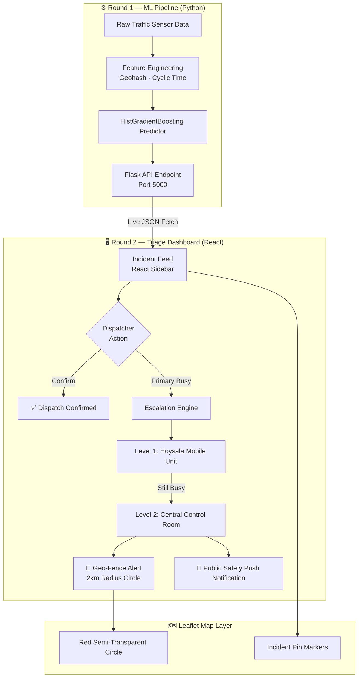
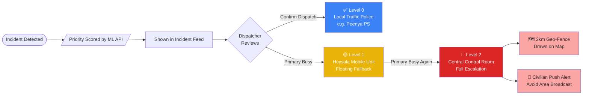
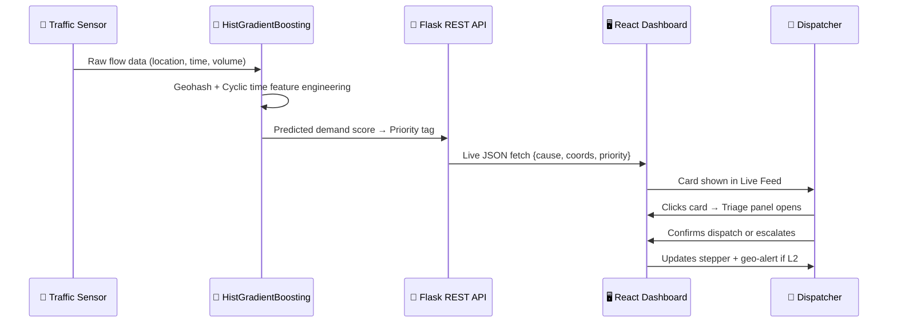
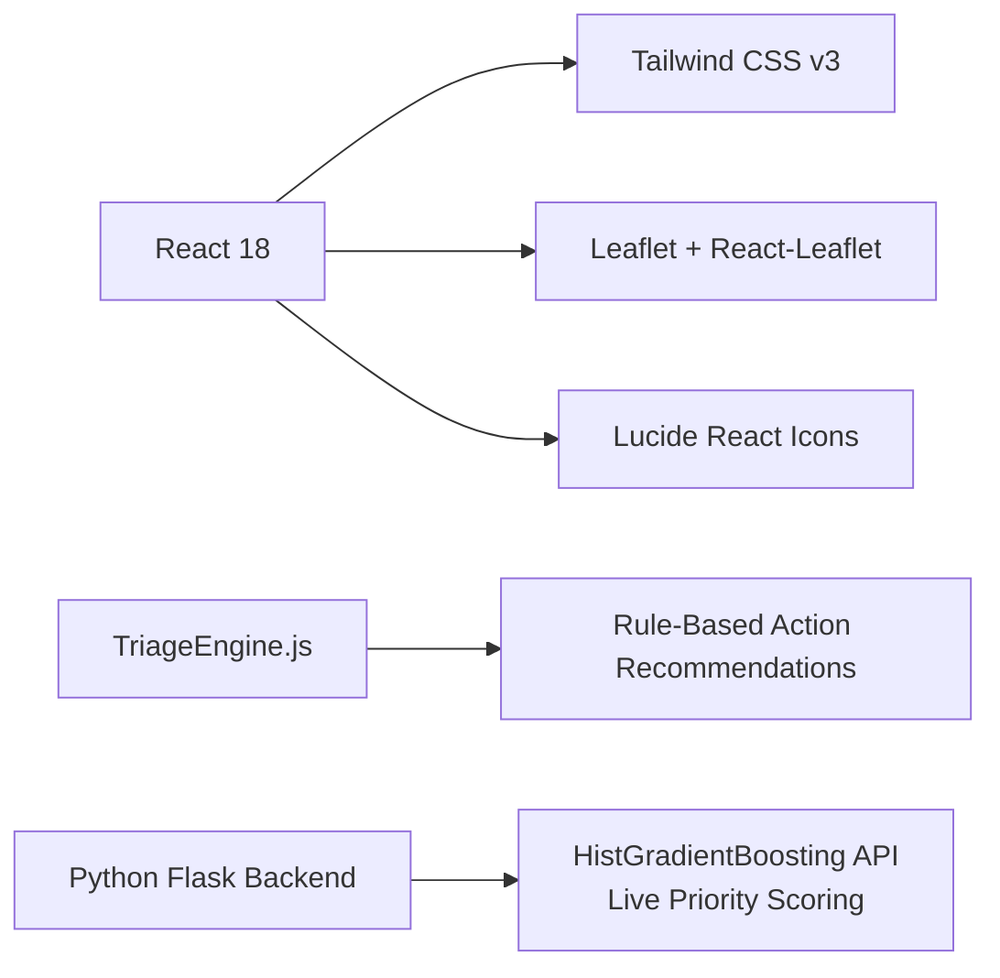
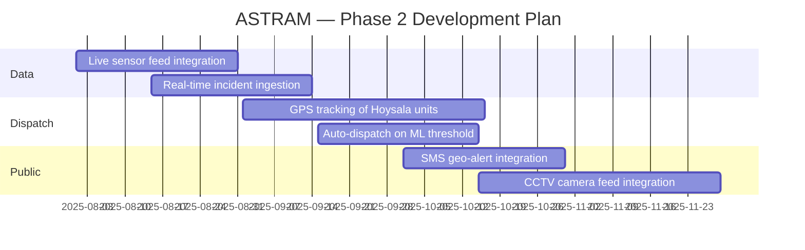

# 🛡️ ASTRAM TRIAGE
**AI-Powered Traffic Incident Command & Dispatch System — Bengaluru**  
*Built for Flipkart Gridlock Hackathon 2.0 · Round 2 Prototype*

Powered by a Round 1 **HistGradientBoostingRegressor** Traffic Demand Prediction model.

## 🔍 What Problem Does This Solve?
Bengaluru's traffic police face a jurisdictional bottleneck — when a high-priority incident (accident, waterlogging, breakdown) occurs, dispatchers manually call the nearest station, wait for availability, then manually escalate if that unit is busy. This takes 4–12 minutes of dead time.

**ASTRAM TRIAGE** compresses that to under 30 seconds with an automated 3-tier escalation chain, real-time geo-alerting, and live ML-driven priority scoring from our Round 1 model.

## 🏗️ System Architecture



---

## 🔁 Escalation Flow



---

## 🧠 How Priority Is Determined (Round 1 → Round 2 Link)



---

## ✨ Features

| Feature | Description | Status |
| :--- | :--- | :---: |
| 📋 **Live Incident Feed** | Sidebar cards with priority tags and addresses | ✅ |
| 🗺️ **Interactive Map** | Leaflet maps with clickable incident pins & dynamic fly-to | ✅ |
| 🤖 **Live ML API** | Real-time demand scoring via Python Flask backend (`HistGradientBoosting`) | ✅ |
| ⚡ **Smart Triage Panel** | Per-incident recommendations from `TriageEngine.js` | ✅ |
| 🔁 **3-Tier Escalation** | Traffic Police → Hoysala Unit → Central Control | ✅ |
| 📊 **Escalation Stepper** | Visual progress tracker across the dispatch chain | ✅ |
| ✅ **Confirm Dispatch** | Button confirms & marks card as "Sent" in sidebar | ✅ |
| 🔴 **Geo-Fence Circle** | 2km red alert radius drawn on map at Level 2 | ✅ |
| 📢 **Push Notification** | Bouncing civilian alert banner at Level 2 | ✅ |

---

## 🛠️ Tech Stack



| Layer | Technology |
|---|---|
| Frontend Framework | React 18 |
| Styling | Tailwind CSS v3 |
| Map Engine | Leaflet · react-leaflet |
| Icons | lucide-react |
| Backend API |	Python 3 · Flask · Flask-CORS |
| ML Model (Round 1) | HistGradientBoostingRegressor · scikit-learn |
| Feature Engineering | Geohash · Cyclic Encoding · Target Encoding |
| Data | Live priority scoring via REST API |

---

## 📁 Project Structure

```text
Gridlock/
├── .gitignore                  # Root gitignore for both Node and Python
├── README.md                   # Main project documentation
│
├── traffic-triage-dashboard/   # 🖥️ ROUND 2: React Frontend
│   ├── public/
│   ├── src/
│   │   ├── App.js              # Main layout, state, API fetch logic
│   │   ├── TriageEngine.js     # Recommendation rules & ML integration hook
│   │   ├── index.js            # Entry point
│   │   └── index.css           # Tailwind directives + Leaflet z-index fix
│   ├── tailwind.config.js
│   ├── postcss.config.js
│   └── package.json
│
└── gridlock-ml/                # ⚙️ ROUND 1: ML & Flask Backend
    ├── backend/
    │   ├── api.py              # Flask REST API serving live predictions
    │   ├── model.pkl           # Trained HistGradientBoosting model
    │   ├── label_encoders.pkl  # Categorical feature encoders
    │   └── *.csv / *.json      # Aggregation tables & imputation stats
    ├── dataset/                # Raw traffic sensor data
    └── source_code.ipynb       # Model training & feature engineering notebook
```

---

## 🚀 Getting Started

Because this project uses a live Machine Learning backend, you need to run two terminals simultaneously.

**1. Clone the repo**
```bash
git clone [https://github.com/Ankita562/traffic-triage-dashboard.git](https://github.com/Ankita562/traffic-triage-dashboard.git)
cd traffic-triage-dashboard
```

# 2. Start the ML Backend (Terminal 1)
```bash
cd gridlock-ml/backend
pip install flask flask-cors joblib scikit-learn pandas numpy
python api.py
# The API server will start running on http://localhost:5000
```


# 3. Start the React Frontend (Terminal 2)
```bash
cd traffic-triage-dashboard
npm install
npm start
# The dashboard will open automatically at http://localhost:3000
```

Open [http://localhost:3000](http://localhost:3000) — no API keys needed, runs fully offline with mock data.

---

## 🖥️ Usage: Triage Workflow

1. **Select an incident** from the left sidebar — the map highlights the location and flies to it.
2. **Review the live ML priority score** and the recommended response unit.
3. **Click "Confirm Dispatch"** — the card gets a green "Sent" badge.
4. **If the primary unit is busy**, click **"Primary Busy"** to escalate:
   * **Level 1** → Routes to **Hoysala Mobile Unit** (floating fallback).
   * **Level 2** → Routes to **Central Control Room** + triggers:
     * 🔴 2km geo-fence circle on the map
     * 📢 Bouncing civilian "Avoid Area" push alert

---

## 🔮 Phase 2 Roadmap



- 📡 **Live sensor data** replacing mock incidents via WebSocket feed
- 🚓 **Real-time GPS tracking** of Hoysala patrol units on the map
- 📱 **SMS geo-alerts** to civilians in the affected radius (Twilio)
- 📷 **CCTV integration** — camera feeds embedded in incident cards
- 🔄 **Auto-dispatch** when ML confidence exceeds threshold, no human needed

---

## 👥 Team

Built for **Flipkart Gridlock Hackathon 2.0** on HackerEarth.

* **Round 1:** Traffic Demand Prediction (`HistGradientBoostingRegressor`)
* **Round 2:** ASTRAM Triage — Real-Time Incident Command Dashboard

**Team Members:**
* Ankita Gupta
* Arushi
* Manaswi

---

## 📄 License

MIT — free to use, fork, and build on.
